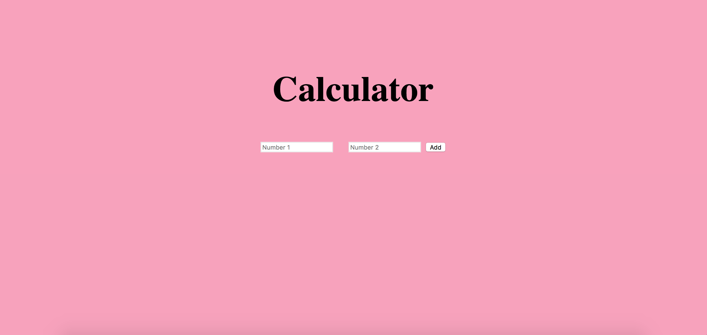

# Calculator-App

A basic calculator application that addes two number and send it to the browser.

# Project Outcomes
<ul>
  <li> Use express js </li>
  <li> Get respond from server</li>
  <li> Post request to the server </li>
</ul>

Requirements:

#Install
$ git clone 
$ cd PROJECT

#Technologies:
HTML
JavaScript
CSS
node.js
express.js
